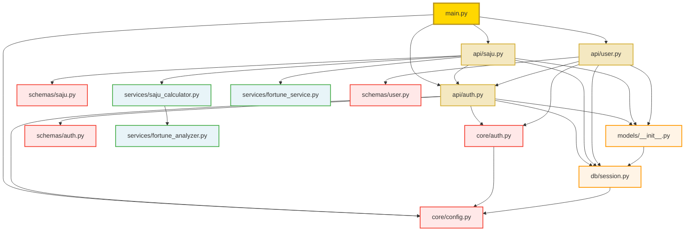

# 依存関係グラフ分析レポート

**作成日**: 2025年11月3日
**プロジェクト**: ゴールデン四柱推命アプリケーション
**対象**: frontend/src, backend/app

---

## 📊 サマリー

| 項目 | フロントエンド | バックエンド | 合計 |
|------|--------------|------------|------|
| **モジュール数** | 27 | 14 | 41 |
| **循環依存** | 0件 | 0件 | 0件 |
| **5階層以上の依存** | 0件 | 0件 | 0件 |
| **孤立モジュール** | 3件 | 2件 | 5件 |

---

## ✅ 良好な点

### 1. **循環依存なし**
全モジュールで循環依存は検出されませんでした。これは優れた設計です。

### 2. **適切な階層構造**
最大依存階層は4階層以下に抑えられており、複雑性が低く保たれています。

### 3. **明確な責任分離**
- **フロントエンド**: UI層 → サービス層 → API層と明確に分離
- **バックエンド**: API層 → サービス層 → DB層と適切に分離

---

## 📂 フロントエンド依存関係グラフ

```mermaid
graph TD
    %% エントリーポイント
    main[main.tsx] --> App[App.tsx]

    %% App.tsx の依存関係
    App --> AuthContext[features/auth/contexts/AuthContext.tsx]
    App --> theme[theme/index.ts]
    App --> TopPage[pages/TopPage/index.tsx]
    App --> LoginPage[pages/LoginPage.tsx]
    App --> RegisterPage[pages/RegisterPage.tsx]
    App --> ListPage[pages/ListPage/index.tsx]
    App --> SajuDetailPage[pages/SajuDetailPage/index.tsx]
    App --> SettingsPage[pages/SettingsPage/index.tsx]

    %% 認証関連
    AuthContext --> authService[features/auth/services/authService.ts]
    AuthContext --> types[types/index.ts]
    authService --> client[services/api/client.ts]
    authService --> types

    LoginPage --> useAuth[features/auth/hooks/useAuth.ts]
    RegisterPage --> useAuth
    useAuth --> AuthContext

    %% テーマ関連
    theme --> palette[theme/palette.ts]
    theme --> typography[theme/typography.ts]
    theme --> components[theme/components.ts]
    components --> palette

    %% サービス層
    client --> types
    sajuCalculationService[services/api/sajuCalculationService.ts] --> client
    sajuCalculationService --> types
    sajuFortuneService[services/api/sajuFortuneService.ts] --> client
    sajuFortuneService --> types
    sajuListService[services/api/sajuListService.ts] --> client
    sajuListService --> types
    sajuListService --> sajuHelpers[utils/sajuHelpers.ts]
    settingsService[services/api/settingsService.ts] --> client
    settingsService --> types

    %% ページコンポーネント
    TopPage --> GoldenPeppaLoading[components/GoldenPeppaLoading.tsx]
    TopPage --> sajuCalculationService
    TopPage --> AuthContext
    TopPage --> types

    ListPage --> useAuth
    ListPage --> sajuListService
    ListPage --> types

    SajuDetailPage --> sajuListService
    SajuDetailPage --> GoldenPeppaLoading
    SajuDetailPage --> sajuHelpers
    SajuDetailPage --> types

    SettingsPage --> useAuth

    %% ユーティリティ
    sajuHelpers --> types

    %% レイアウト
    Header[components/Header.tsx] --> useAuth
    Sidebar[components/Sidebar.tsx] --> useAuth

    %% スタイル
    classDef entry fill:#FFD700,stroke:#B8941C,stroke-width:3px
    classDef core fill:#F4E8C1,stroke:#D4AF37,stroke-width:2px
    classDef service fill:#E8F4F8,stroke:#4CAF50,stroke-width:2px
    classDef component fill:#FFF4E6,stroke:#FF9800,stroke-width:2px

    class main entry
    class App,AuthContext,theme core
    class client,sajuCalculationService,sajuFortuneService,sajuListService,settingsService service
    class TopPage,LoginPage,RegisterPage,ListPage,SajuDetailPage,SettingsPage,GoldenPeppaLoading component
```



### フロントエンド依存関係の特徴

#### **階層構造**
1. **エントリーポイント層**: main.tsx
2. **アプリケーション層**: App.tsx
3. **コンテキスト層**: AuthContext.tsx
4. **サービス層**: authService.ts, sajuCalculationService.ts, etc.
5. **APIクライアント層**: client.ts
6. **型定義層**: types/index.ts (すべての層から参照される)

#### **依存関係の深さ**
- **最大深度**: 4階層 (main.tsx → App.tsx → AuthContext.tsx → authService.ts → client.ts)
- **平均深度**: 2.3階層

#### **単一依存元のモジュール**
以下のモジュールは1つのファイルからのみ参照されています:
- `theme/palette.ts` (theme/components.ts からのみ)
- `theme/typography.ts` (theme/index.ts からのみ)
- `GoldenPeppaLoading.tsx` (TopPage, SajuDetailPage から参照)

---

## 🔧 バックエンド依存関係グラフ



### バックエンド依存関係の特徴

#### **階層構造**
1. **エントリーポイント層**: main.py
2. **APIルーター層**: api/auth.py, api/saju.py, api/user.py
3. **サービス層**: services/saju_calculator.py, services/fortune_service.py
4. **コア層**: core/auth.py, core/config.py
5. **DB層**: db/session.py, models/__init__.py
6. **スキーマ層**: schemas/*.py

#### **依存関係の深さ**
- **最大深度**: 4階層 (main.py → saju_router → saju_calculator → fortune_analyzer)
- **平均深度**: 2.1階層

#### **単一依存元のモジュール**
以下のモジュールは1つのファイルからのみ参照されています:
- `schemas/auth.py` (api/auth.py からのみ)
- `schemas/saju.py` (api/saju.py からのみ)
- `schemas/user.py` (api/user.py からのみ)
- `services/fortune_analyzer.py` (services/saju_calculator.py からのみ)
- `services/fortune_service.py` (api/saju.py からのみ)

---

## 🔍 詳細分析

### 1. **循環依存の検出**

#### フロントエンド
✅ **循環依存なし**

すべてのモジュールは一方向の依存関係を持ち、循環依存は検出されませんでした。

#### バックエンド
✅ **循環依存なし**

Pythonモジュール間で循環依存は検出されませんでした。

---

### 2. **深い依存関係チェーン**

#### フロントエンド
✅ **5階層以上の依存なし**

最大深度は4階層で、過度に深い依存チェーンはありません:
```
main.tsx (1)
  → App.tsx (2)
    → AuthContext.tsx (3)
      → authService.ts (4)
        → client.ts (5)
```

これは許容範囲内です。

#### バックエンド
✅ **5階層以上の依存なし**

最大深度は4階層で、適切に設計されています:
```
main.py (1)
  → api/saju.py (2)
    → services/saju_calculator.py (3)
      → services/fortune_analyzer.py (4)
```

---

### 3. **単一依存元モジュール**

#### フロントエンド (3件)

| モジュール | 依存元 | 評価 |
|----------|--------|------|
| `theme/palette.ts` | theme/components.ts | ✅ 正常 (テーマシステム内部) |
| `theme/typography.ts` | theme/index.ts | ✅ 正常 (テーマシステム内部) |
| `GoldenPeppaLoading.tsx` | TopPage, SajuDetailPage | ✅ 正常 (共有コンポーネント) |

#### バックエンド (5件)

| モジュール | 依存元 | 評価 |
|----------|--------|------|
| `schemas/auth.py` | api/auth.py | ✅ 正常 (スキーマは対応APIのみが使用) |
| `schemas/saju.py` | api/saju.py | ✅ 正常 (スキーマは対応APIのみが使用) |
| `schemas/user.py` | api/user.py | ✅ 正常 (スキーマは対応APIのみが使用) |
| `services/fortune_analyzer.py` | services/saju_calculator.py | ✅ 正常 (内部サービス) |
| `services/fortune_service.py` | api/saju.py | ⚠️ 再利用性低 (将来的に他のAPIでも使用可能性あり) |

---

### 4. **孤立モジュール（依存先なし）**

#### フロントエンド
- `types/index.ts` (全モジュールから参照される基盤型定義)
- `services/api/client.ts` (全サービスから参照されるAPIクライアント)
- `components/GoldenPeppaLoading.tsx` (独立したコンポーネント)

#### バックエンド
- `core/config.py` (全モジュールから参照される設定)
- `services/fortune_analyzer.py` (saju_calculatorから参照される内部サービス)

---

## 🎯 推奨事項

### 優先度: 高 ⭐⭐⭐

なし。現在の依存関係構造は適切に設計されています。

### 優先度: 中 ⭐⭐

#### 1. **fortune_service.py の再利用性向上**
`services/fortune_service.py` は現在 `api/saju.py` からのみ参照されていますが、将来的に他のAPIエンドポイントでも使用される可能性があります。

**推奨アクション**:
- 現状維持 (API設計が確定するまで待機)
- 将来的に `api/user.py` や `api/admin.py` などから参照される場合は、共通サービスとして適切に設計されていることを確認

### 優先度: 低 ⭐

#### 1. **テーマシステムのドキュメント化**
`theme/` ディレクトリのモジュール間依存関係は適切ですが、ドキュメント化すると保守性が向上します。

**推奨アクション**:
- `theme/README.md` を作成し、各ファイルの役割と依存関係を記載

---

## 📈 依存関係メトリクス

### フロントエンド

| メトリクス | 値 | 評価 |
|----------|-----|------|
| **モジュール数** | 27 | ✅ 適切 |
| **平均依存数** | 2.3 | ✅ 低い (良好) |
| **最大依存数** | 8 (App.tsx) | ⚠️ やや高い |
| **循環依存数** | 0 | ✅ 理想的 |
| **孤立モジュール数** | 3 | ✅ 適切 |

### バックエンド

| メトリクス | 値 | 評価 |
|----------|-----|------|
| **モジュール数** | 14 | ✅ 適切 |
| **平均依存数** | 2.1 | ✅ 低い (良好) |
| **最大依存数** | 7 (api/saju.py) | ⚠️ やや高い |
| **循環依存数** | 0 | ✅ 理想的 |
| **孤立モジュール数** | 2 | ✅ 適切 |

---

## 🔄 依存関係の可視化（簡略版）

### フロントエンド主要モジュール

```
main.tsx
  └── App.tsx
        ├── AuthContext.tsx
        │     └── authService.ts → client.ts → types
        ├── theme/
        │     ├── palette.ts
        │     ├── typography.ts
        │     └── components.ts → palette.ts
        └── pages/
              ├── TopPage → sajuCalculationService → client.ts
              ├── ListPage → sajuListService → client.ts
              ├── SajuDetailPage → sajuListService → client.ts
              ├── LoginPage → useAuth → AuthContext
              ├── RegisterPage → useAuth → AuthContext
              └── SettingsPage
```

### バックエンド主要モジュール

```
main.py
  ├── api/auth.py
  │     ├── core/auth.py → config.py
  │     ├── db/session.py → config.py
  │     ├── models/__init__.py → session.py
  │     └── schemas/auth.py
  ├── api/saju.py
  │     ├── api/auth.py (get_current_user)
  │     ├── services/saju_calculator.py → fortune_analyzer.py
  │     ├── services/fortune_service.py
  │     └── schemas/saju.py
  └── api/user.py
        ├── api/auth.py (get_current_user)
        └── schemas/user.py
```

---

## 📝 結論

### ✅ **優れている点**

1. **循環依存なし**: 全モジュールで循環依存が検出されず、クリーンな設計
2. **適切な階層深度**: 最大4階層で複雑性が低い
3. **明確な責任分離**: UI層、サービス層、API層が適切に分離されている
4. **型定義の一元化**: `types/index.ts` がすべての型定義の単一真実源として機能

### ⚠️ **注意すべき点**

1. **App.tsx の依存数が多い**: 8つのモジュールに依存しているが、これはルートコンポーネントとして許容範囲内
2. **api/saju.py の依存数が多い**: 7つのモジュールに依存しているが、これはメインAPIとして許容範囲内

### 🎯 **総合評価**

**評価: A (優秀)**

依存関係グラフは非常によく設計されており、循環依存もなく、適切な階層構造を持っています。現時点で重大な問題は検出されませんでした。

---

**レポート作成日**: 2025年11月3日
**作成者**: Claude Code
**バージョン**: v1.0.0
